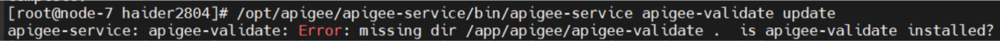
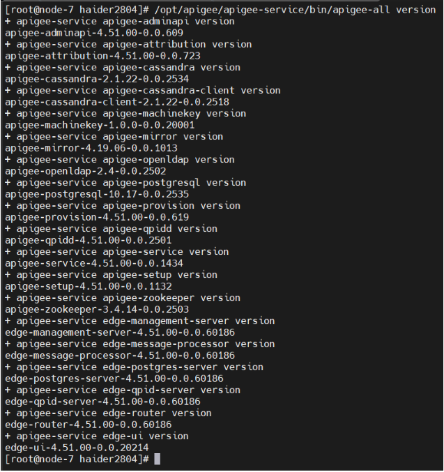

# Apigee Edge Upgrade Guide

### 4.19.06 / 4.50.00 → 4.51.00

<!-- 👉 Add a banner or hero screenshot here -->

## Prerequisites

* **Hardware**: 2 vCPU, **8 GB RAM** (minimum for single‑node installs)
* **Network**: Outbound Internet access on the node
* **Access**: `root` (or sudo) privileges

---

## Quick Path – All‑in‑One Node

1. **Backup every component**

   ```bash
   /opt/apigee/apigee-service/bin/apigee-all backup
   ```

   ➜ Produces one `*.tar.gz` file per component under:
   `/opt/apigee/backup/<component>/<backup‑time‑date>.tar.gz`

2. **Fetch the 4.51.00 bootstrap script**

   ```bash
   curl https://software.apigee.com/bootstrap_4.51.00.sh -o /tmp/bootstrap_4.51.00.sh
   ```

3. **Install the `apigee-service` utility & deps**

   ```bash
   sudo bash /tmp/bootstrap_4.51.00.sh apigeeuser=<USERNAME> apigeepassword=<PASSWORD>
   ```

4. **Upgrade the `apigee-setup` utility**

   ```bash
   /opt/apigee/apigee-service/bin/apigee-service apigee-setup update
   ```

5. **Upgrade `apigee-validate` on the Management Server**

   ```bash
   # Confirm the directory exists
   ls /opt/apigee/apigee-validate

   # Then update
   /opt/apigee/apigee-service/bin/apigee-service apigee-validate update
   ```

   

6. **Upgrade `apigee-provision` on the Management Server**

   ```bash
   /opt/apigee/apigee-service/bin/apigee-service apigee-provision update
   ```

7. **Run the one‑node standalone upgrade**

   ```bash
   /opt/apigee/apigee-setup/bin/update.sh -c all -f /tmp/configFile
   ```

   **NOTE:** If Cassandra fails during this step it’s usually due to **low RAM**. Ensure at least 4 GB of free memory during the schema migration.

8. **Verify all component versions**

   ```bash
   /opt/apigee/apigee-service/bin/apigee-all version
   ```

   

---

## Troubleshooting Tips

| Symptom                                                                | Cause                                 | Resolution                                      |
| ---------------------------------------------------------------------- | ------------------------------------- | ----------------------------------------------- |
| `Error: missing dir /app/apigee/apigee-validate` when running `update` | `apigee-validate` isn’t installed yet | Run **step 5** before retrying the update       |
| Cassandra service fails to start during upgrade                        | Insufficient memory                   | Add swap or temporarily allocate ≥4 GB free RAM |

---

## Useful Links

* **Official Release Notes 4.51.00** – [https://docs.apigee.com/private-cloud/v4.51.00/update-apigee-edge-41906-45100](https://docs.apigee.com/private-cloud/v4.51.00/update-apigee-edge-41906-45100)


